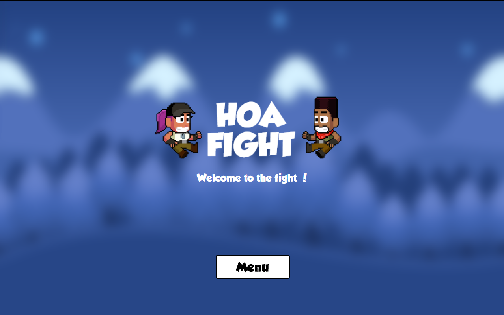
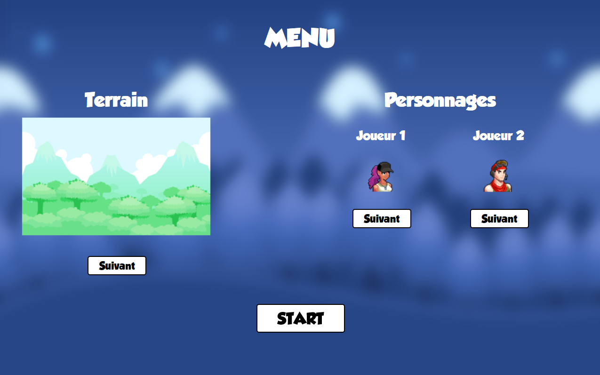
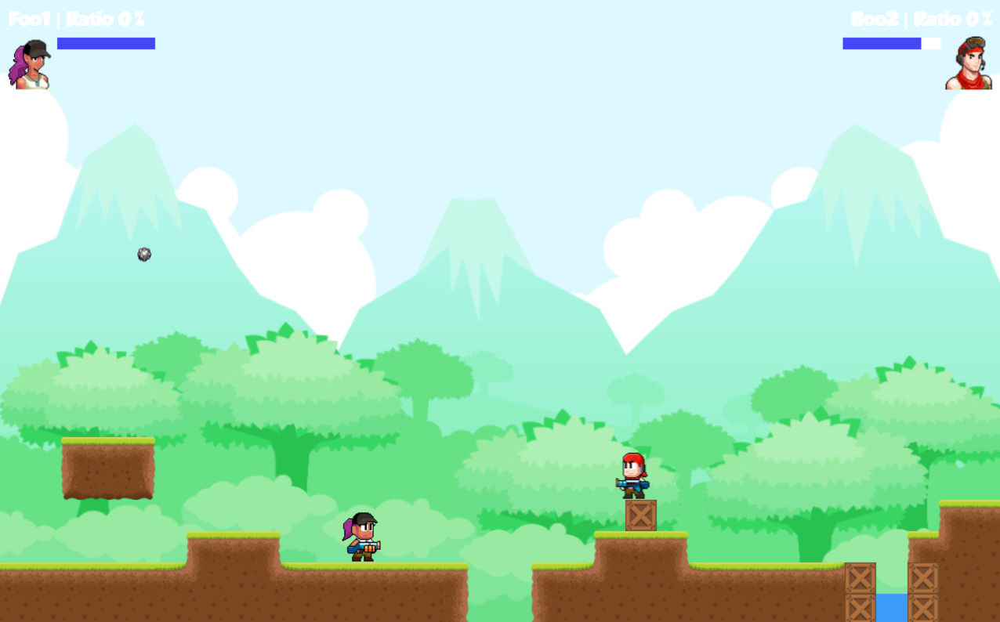

<!-- @format -->

# Hoa Fight

### Local 1v1 shooter-combat game in the browser

Made with Phaser 3 (https://phaser.io) and Typescript.

Goal is to eliminate the other player while avoiding all the bombs that fall off the sky randomly.
You can choose the terrain and each player can choose their character.
Being hit by a bomb or by the other player result in decreasing your life and your health bar by 20%.

I think I will add some things like gamepad handling, some explosions, general tweening, make better maps, but I think the game will remain at a "advanced prototype" stage.

#### Controls:
-   Player 1 : Jump = UP ARROW • Walk left = LEFT ARROW • Walk right = RIGHT ARROW • Shoot = SHIFT
-   Player 2 : Jump = S KEY • Walk left = Q KEY • Walk right = D ARROW • Shoot = SPACE

#### Credits:
-   The Grobold font was made by Guy Buhry : https://www.dafont.com/fr/guy-buhry.d1243
-   Graphical assets are from https://www.gamedevmarket.net/
-   Tilemaps are created with https://www.mapeditor.org/
-   OST and sounds was made by my teammate XorGentlem4n : https://github.com/XorGentlem4n

I also made a website using Vue.js, Express and SQL (MariaDB), that is linked to this game, where you can see your stats and ranking of all the players.

